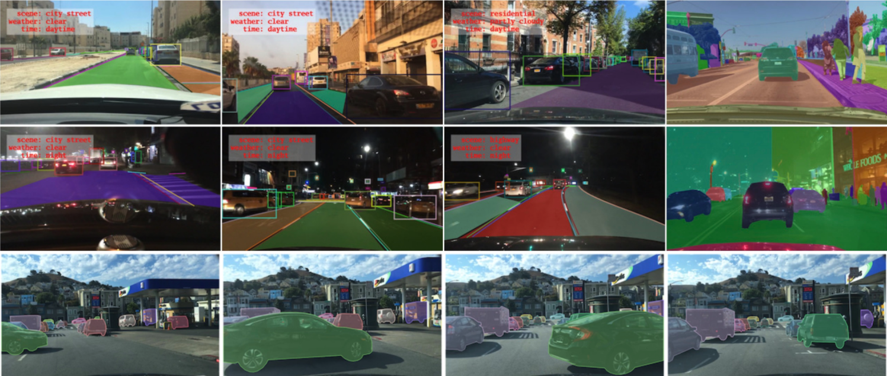
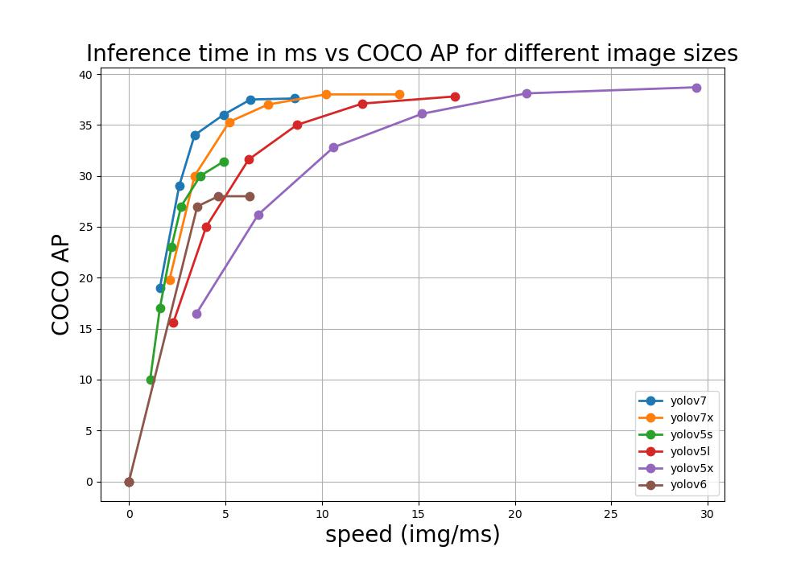
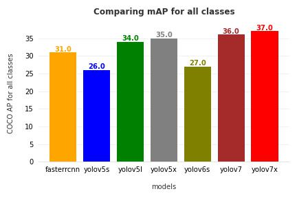
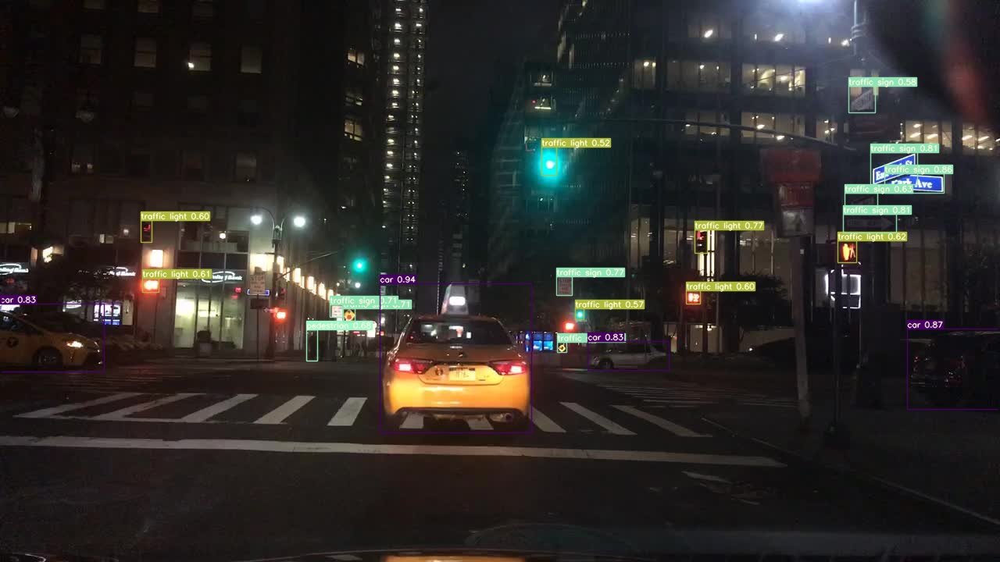
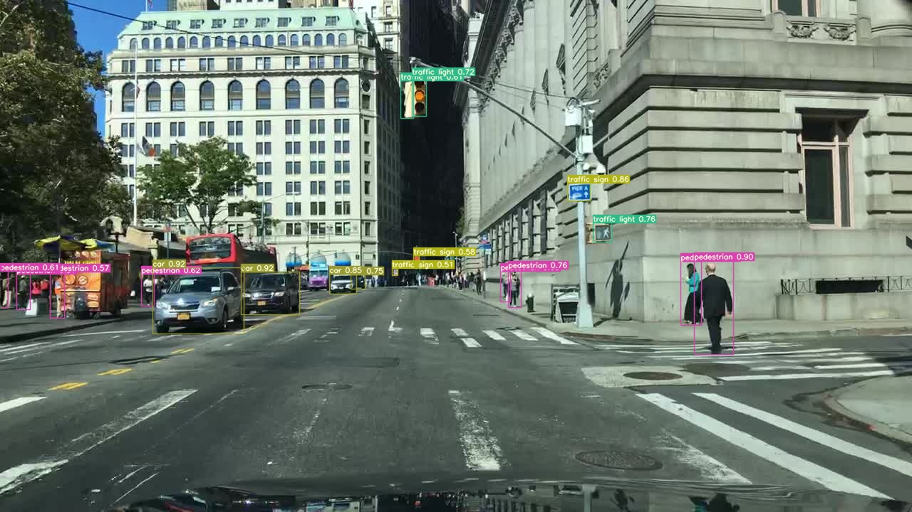
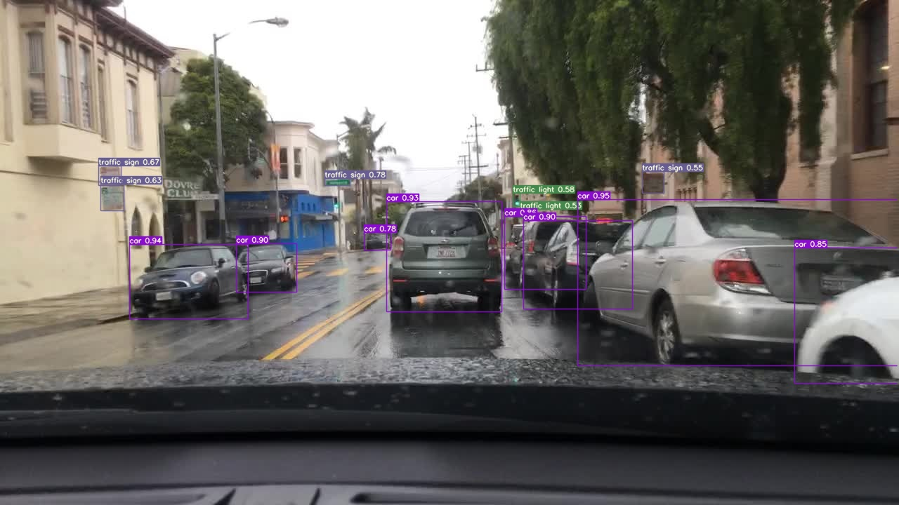

# MSc in Artificial Intelligence Thesis


 
 This repository contains the code for my Master thesis. I will cover different tasks in computer vision field, like object detection, semantic segmentation, instance segmentation and panoptic segmentation. I will be using different SOTA models.
 
 The main goal of this work is to compare several object detection models in terms of speed and accuracy. In addition, I ran Mask RCNN to perform instance segmentation on BDD100K dataset.
 
 ---
 
## Dataset

Dataset used is BDD100K which is available [here](https://www.bdd100k.com/).
In addition, the data is available on [my google drive](https://drive.google.com/drive/folders/1jupf1DEYrcL7nkt6gIDAx6ioIzv0yAYO?usp=sharing).

 ---
 
 ## Project Structure
```python
├─src
│ ├─config
│ │ ├─defaults.py # default configuration
│ ├─dataset
│ │ ├─bdd.py  # Superclass dataset，Parent class
│ │ ├─bdd_detetcion.py # Subclass for detection task
│ │ ├─bdd_drivable_segmentation.py # Subclass for drivabel area segmetation task
│ │ ├─bdd_instance_segmentation.py # Subclass for instance segmetation task
│ │ ├─bdd_instance_segmentation_drivable.py # Subclass for instance segmentation with drivable area task
│ │ ├─bdd_utils.py  # file contains useful method
│ ├─dbs
│ │ ├─test_db.json # pre-created test db
│ │ ├─train_db.json # pre-created train db
│ │ ├─val_db.json # pre-created val db
│ ├─models
│ │ ├─Detection
│ │ │ ├─detection_models.py  # file contains the method to return the Faster RCNN model
│ │ │ ├─Faster_RCNN.py # Faster RCNN class
│ │ ├─Segmentation
│ │ │ ├─FCN.py # FCN class
│ │ │ ├─DeepLab.py # DeepLabv3+ class
│ │ │ ├─MaskRCNN.py # MaskRCNN class
│ │ │ ├─segmenation_models.py # file contains the method to return the models for segmentatation
│ ├─utils
│ │ ├─DataLoaders.py # dataloader function
| | ├─utils.py # useful function
| | ├─Data Augmentation.ipynb # Notebook contains tutorial for data augmentation
│ ├─BDD Detection.ipynb # Notebook contains tutorial how to use detection class
│ ├─BDD Drivable Area.ipynb # Notebook contains tutorial how to use drivable class
│ ├─BDD Instance Segmentation.ipynb # Notebook contains tutorial how to use instance segmentation class
│ ├─YOLO Format.ipynb # Notebook contains tutorial how convert xyxy format to yolo format
├─doc
│ ├─images # some images
├─scirpts
│ ├─data.py # download the data from google drive
│ ├─weights.py # download the weights from google drive
├─notebooks
│ ├─Faster RCNN Notebook.ipynb # Faster RCNN notebook
│ ├─FCN Notebook.ipynb # FCN notebook
├─api
│ ├─app.py  # Flask App
├─yolov5  # yolov5 repository
├─yolov6  # yolov6 repository
├─yolov7  # yolov7 repository
├─dataset
│ ├─bdd100k
│ │ ├─images
│ │ │ ├─10K
│ │ │ ├─100K
│ │ ├─labels
│ │ │ ├─det_20
│ │ │ ├─drivable
│ │ │ ├─lane
│ │ │ ├─pan_seg
│ │ │ ├─ins_seg
│ │ │ ├─pan_seg
├─train.py  # file contains the functions to train Faster RCNN and MASk RCNN
├─test.py  # file contains the functions to evaluate the models
├─detect.py  # file contains the functions to run inference
├─prepare.py  # file used to prepare the data to YOLO algorithms
├─util.py  # contains useful functions to train, test and detect
```
---
## Requirements

Please install requirements using: 
```bash
pip install -R requirements.txt
```

---
## Installation
if you want to install the data manually you can download them from my [google drive](https://drive.google.com/drive/folders/1jupf1DEYrcL7nkt6gIDAx6ioIzv0yAYO?usp=sharing). Or you can run:
```bash
pip install gdown
python scripts/data.py
```
make sure you put the data in the right place. see the project structure section.

Weights can be dowloaded as well from my [google drive](https://drive.google.com/drive/folders/1yIeiFDJ0quhH_Z0lxGnI0suEoiG2Jy2h?usp=sharing). Or you can run:
```bash
python scripts/weights.py
```

Now let us clone some repositories (recommendation: Create new virtual environment when working with each one):
```bash
git clone https://github.com/ultralytics/yolov5
cd yolov5
pip install -r requirements.txt
pip install "opencv-python-headless<4.3"
```

```bash
git clone https://github.com/WongKinYiu/yolov7.git
cd yolov7
pip install -r requirements.txt
```

```bash
git clone https://github.com/meituan/YOLOv6.git
cd YOLOv6
pip install -r requirements.txt
```


---
## Train
### Object Detection
#### Faster RCNN
To train **Faster RCNN** model run the following command:
```bash
python train.py --model fasterrcnn  --data './data/fasterrcnn.yaml' --batch-size 1 --img-size 640 --total_epochs 20 --logger_path 'logs' --checkpoint_path 'checkpoints' --project 'Faster RCNN' --name 'version0' --num_workers 1 
```
Where `model` to specify that we want **Faster RCNN** model, `batch-size` for batch size, `img-size` for resizing the images and finally `--total_epochs` for the epochs.

#### Yolov5
To train using **Yolov5**:

1- Create folder for the dataset inside yolov5 folder:
```bash
cd yolov5
mkdir dataset
```
2- Create `dataset.yaml` file and place it inside `yolov5/data` (you can copy the one in [data](https://github.com/Khaliladib11/MSc_Thesis/blob/main/data/dataset_yolov5.yaml) folder).

3- Prepare the data to be aligned with the YOLO format:
```bash
cd ..
python prepare.py --yolo_version yolov5 --dataset_path 'yolov5/dataset' --data './data/yolo.yaml'
```
4- train the model:
```bash
cd yolov5
python train.py --img 640 --batch 32 --epochs 50 --data './data/dataset.yaml' --weights yolov5s.pt --optimizer Adam --name yolo5s_bdd
```
In place of `yolov5s.pt` you can select bigger model like `yolov5l.pt` or `yolov5x.pt`.

For more information follow this [Tutorials](https://github.com/ultralytics/yolov5/wiki/Train-Custom-Data).

#### Yolov7
Almost the same as [Yolov5](####Yolov5)

1- Create folder for the dataset inside **yolov7** folder:
```bash
cd yolov7
mkdir dataset
```
2- Create `dataset.yaml` file and place it inside `yolov7/data` (you can copy the one in [data](https://github.com/Khaliladib11/MSc_Thesis/blob/main/data/dataset_yolov7.yaml) folder).

3- Prepare the data to be aligned with the YOLO format:
```bash
cd ..
python prepare.py --yolo_version yolov7 --dataset_path 'yolov7/dataset' --data './data/yolo.yaml'
```
4- train the model:
```bash
cd yolov7
python train.py --device 0 --batch-size 32 --data data/dataset.yaml --img 640 640  --epochs 100 --cfg cfg/training/yolov7-custom.yaml --weights 'yolov7_training.pt' --adam --name yolov7_bdd --hyp data/hyp.scratch.custom.yaml

```
For more information follow this [Tutorials](https://blog.paperspace.com/yolov7/).

#### Yolov7
1- Create folder for the dataset inside **yolov6** folder:
```bash
cd YOLOv6
mkdir dataset
```
2- Create `dataset.yaml` file and place it inside `yolov6/data` (you can copy the one in [data](https://github.com/Khaliladib11/MSc_Thesis/blob/main/data/dataset_yolov7.yaml) folder).

3- Prepare the data to be aligned with the YOLO format:
```bash
cd ..
python prepare.py --yolo_version yolov5 --dataset_path 'YOLOv6/dataset' --data './data/yolo.yaml'
```
4- train the model:
```bash
cd YOLOv6
python tools/train.py --device 0 --batch-size 32 --data-path data/dataset.yaml --img 640 640  --epochs 100

```

---

## Evaluation
### Faster RCNN
To evaluate **Faster RCNN** model using mean average precision run the following command:
```bash
python test.py --model fasterrcnn --data './data/fasterrcnn.yaml' --weights 'path/to/fastercnn/weights' --save-path './fasterrcnn_map.csv'
```

### YOLO
To evaluate **Yolov5** and **Yolov7** model using mean average precision run the following commands:

First for **yolov5**:
```bash
cd yolov5
python val.py --data 'data/dataset.yaml' --weights 'path/to/weights' --task test --save-txt --save-conf --project 'path/to/save/pred'
```

For **yolov7**:
```bash
cd yolov7
python test.py --data 'data/dataset.yaml' --weights 'path/to/weights' --task test --save-txt --save-conf --project 'path/to/save/pred'
```

After that run this command:
```bash
cd ..
python yolo_eval.py --pred 'path/to/labels/folder' --gt 'path/to/ground/truth'
```

Where `pred` is the path where the yolo models will save the prediction for each image as `.txt` files. `gt` is the path for the ground truth generated from the `prepare.py` files.

---

## Inference
### Faster RCNN
```bash
python detect.py --model 'fasterrcnn' --data './data/fasterrcnn.yaml' --weights 'path/to/weights' --source 'path/to/image' --confidence-score 0.5 --save-path 'predicted_image.jpg'
```
### Mask RCNN
```bash
python detect.py --model 'maskrcnn' --data './data/maskrcnn.yaml' --weights 'path/to/weights' --source 'path/to/image' --confidence-score 0.5 --save-path 'predicted_image.jpg'
```
### yolov5
```bash
python detect.py --model 'yolov5' --weights 'path/to/weights' --source 'path/to/image' --confidence-score 0.5 --save-path 'yolov5_inference.jpg'
```
### yolov7
```bash
python detect.py --model 'yolov7' --weights 'path/to/weights' --source 'path/to/image' --confidence-score 0.5 --save-path 'yolov7_inference.jpg'
```

## Results




To see result run:
```bash
python results.py
```
---

## Demo
checkout my YouTube video [here](https://www.youtube.com/watch?v=Iz9UvtoOEIY&lc=UgyuctQDF_CRAQKhMpR4AaABAg).

some results from yolov7x model:





---
## Weights
Weights can be downloaded from this [link](https://drive.google.com/drive/folders/1yIeiFDJ0quhH_Z0lxGnI0suEoiG2Jy2h?usp=sharing).

---
## Run Server
```bash
cd api
flask run
```
